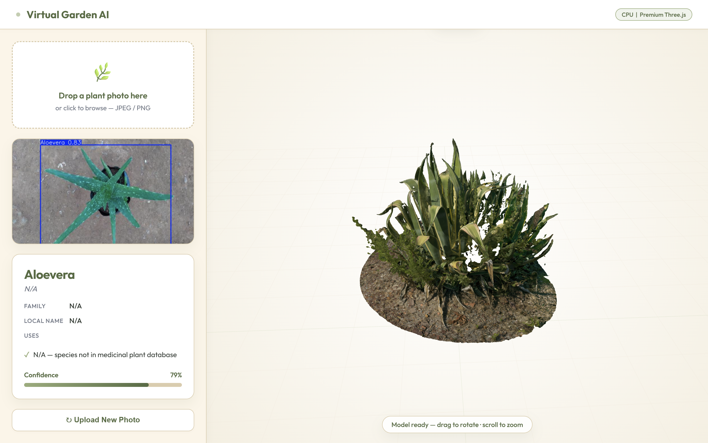

# 🌿 Virtual Garden AI

An end-to-end pipeline that detects plant species via YOLOv8, reconstructs them in 3D using NeRF/COLMAP, and serves them through an interactive FastAPI-powered viewer — all on CPU.

---

## 📸 UI Preview



---

## 📋 Prerequisites

| Tool | Version | Notes |
|------|---------|-------|
| **Python** | 3.10 | Download from [python.org](https://www.python.org/downloads/) |
| **COLMAP** | Latest | Windows installer: [colmap.github.io](https://colmap.github.io/install.html) — add to `PATH` |
| **Git** | Latest | Download from [git-scm.com](https://git-scm.com/download/win) |

> **Note:** No GPU required. All phases run on CPU. A modern multi-core CPU is recommended.

---

## ⚙️ Installation

```bash
# 1. Clone the repository
git clone https://github.com/nikhilkushawaha/Virtual-Herbal-Garden.git
cd virtualgarden

# 2. Create a virtual environment (recommended)
python -m venv venv
venv\Scripts\activate   # Windows

# 3. Install all dependencies (CPU-only, no CUDA)
pip install -r requirements.txt
```

> ⚠️ Do **not** install `torch` with a `+cu118` or any CUDA index URL — this project targets CPU-only environments.

---

## 🧪 Training Resources (Google Colab)

The YOLOv8 model was trained on Google Colab using a T4 GPU. The Colab notebooks, training configs, and result outputs (confusion matrix, mAP curves, validation predictions) are available in the Drive folder below:

📁 **[Open Training Folder on Google Drive](https://drive.google.com/drive/folders/1_qSfNRRtpCLDDe5sm66W-2PQUi6TKxru?usp=sharing)**

The folder contains:
- `train.ipynb` — full YOLOv8 training notebook
- `results/` — mAP curves, confusion matrix, per-class AP scores
- `best.pt` — final trained model weights

---

## 🚀 Running Each Phase

### Phase 1 — Plant Detection Training (YOLOv8)

Train the YOLOv8 model on your labelled plant dataset:

```bash
python detection/train.py
```

Run inference on new images:

```bash
python detection/predict.py --source path/to/image.jpg
```

---

### Phase 2 — 3D Reconstruction (NeRF + COLMAP)

> ⏱️ **NeRF on CPU takes 30–90 minutes per species.** Plan accordingly.

First, extract frames from a plant video:

```bash
python reconstruction/preprocess.py --video path/to/plant_video.mp4
```

Run COLMAP sparse reconstruction (ensure `colmap` is in `PATH`):

```bash
python reconstruction/colmap_runner.py --scene data/scenes/aloevera
```

Train NeRF and export a `.glb` mesh:

```bash
python reconstruction/nerf_train.py --scene data/scenes/aloevera
python reconstruction/export_mesh.py --scene data/scenes/aloevera
```

---

### Phase 3 — Backend API (FastAPI)

Start the REST API server:

```bash
uvicorn backend.main:app --reload --host 0.0.0.0 --port 8000
```

API docs available at: [http://localhost:8000/docs](http://localhost:8000/docs)

---

### Phase 4 — 3D Viewer

Open the interactive viewer in your browser:

```bash
# Serve the viewer frontend
python -m http.server 3000 --directory viewer/
```

Then navigate to [http://localhost:3000](http://localhost:3000).

---

## 📁 Folder Structure

```text
virtualgarden/
├── backend/            # FastAPI REST API (species_db.py, main.py)
├── configs/            # YAML configuration files
├── data/               # Raw images, scenes (gitignored)
├── detection/          # YOLOv8 training & inference (train.py, predict.py)
├── models/             # Trained model weights (gitignored)
├── reconstruction/     # 3D Reconstruction Pipeline
│   ├── colmap_runner.py  # Runs COLMAP for sparse reconstruction
│   ├── export_mesh.py    # Converts NeRF density to .glb mesh
│   ├── nerf_train.py     # CPU-optimized Tiny-NeRF training
│   ├── prepare_data.py   # Prepares images and camera poses
│   └── run_all.py        # Master pipeline orchestrator
├── tests/              # Unit & integration tests
├── viewer/             # Web-based 3D viewer (Three.js)
├── UI.png              # UI screenshot
├── README.md           # Project documentation
└── requirements.txt    # Python dependencies
```

---

## 🔄 Code Workflow

The project follows a linear, end-to-end pipeline:

1. **Input & Detection** (`detection/`): Raw images or videos are processed using YOLOv8 to detect and isolate the plant species from the background.
2. **Data Preparation** (`reconstruction/prepare_data.py`): Frames are extracted and organized.
3. **Sparse Reconstruction** (`reconstruction/colmap_runner.py`): COLMAP estimates camera poses and creates a sparse point cloud.
4. **Dense 3D Reconstruction** (`reconstruction/nerf_train.py`): A CPU-optimized Tiny-NeRF model trains on the images and camera poses to learn a volumetric representation of the plant.
5. **Mesh Generation** (`reconstruction/export_mesh.py`): The trained NeRF density field is converted into a standard `.glb` 3D mesh via Marching Cubes.
6. **API Serving** (`backend/`): A FastAPI backend serves the generated 3D models and associated metadata.
7. **Visualization** (`viewer/`): A Three.js web interface fetches data from the API and renders the interactive 3D plant models in the browser.

---

## 💻 Code Snippet

Here is an example from our orchestrator script (`reconstruction/run_all.py`), which ties the entire 3D reconstruction pipeline together:

```python
# reconstruction/run_all.py (Pipeline snippet)

# STEP 1: Prepare data and camera poses via COLMAP
transforms_path = prepare_data(
    species=species,
    images_dir=images_dir,
    skip_colmap=skip_colmap,
)

# STEP 2: Train Tiny-NeRF on CPU
ckpt_path = train_nerf(
    species=species,
    iterations=iterations,
    img_w=img_wh[0],
    img_h=img_wh[1],
    near=near,
    far=far,
)

# STEP 3: Export the trained NeRF to a .glb mesh using Marching Cubes
glb_path = export_mesh(
    species=species,
    resolution=resolution,
    threshold=threshold,
)
```

---

## 📝 Notes

- **NeRF CPU performance**: Expect **30–90 minutes per species** depending on number of frames and CPU cores. Use `--max-steps` flag to reduce training time during development.
- All `.pt` model weights and `.glb` mesh exports are gitignored — keep your own backups.
- The `data/` directory is gitignored — manage datasets locally or via Roboflow.

---

## 🤝 Contributing

1. Fork the repository
2. Create a feature branch: `git checkout -b feature/my-feature`
3. Commit your changes: `git commit -m "feat: add my feature"`
4. Push and open a Pull Request

---

## 👥 Authors

| Name | Role |
|------|------|
| **Nikhil Kushawaha** | Lead Developer — Detection pipeline, backend, project architecture |
| **Siddhartha Kunwar** | 3D Reconstruction — NeRF training & mesh export |
| **Vansh Trivedi** | Frontend — Three.js viewer & UI |
| **Ansh Kumar Pandey** | Data collection, dataset preparation & validation |

📌 B.Tech (AI & ML) — Ajay Kumar Garg Engineering College, Ghaziabad
🔗 Portfolio: [nikverse.me](https://nikverse.me) · GitHub: [github.com/nikhilkushawaha](https://github.com/nikhilkushawaha)

---

## 📄 License

This project is licensed under the **MIT License**.

```
MIT License

Copyright (c) 2025 Nikhil Kushawaha, Siddhartha Kunwar, Vansh Trivedi, Ansh Kumar Pandey

Permission is hereby granted, free of charge, to any person obtaining a copy
of this software and associated documentation files (the "Software"), to deal
in the Software without restriction, including without limitation the rights
to use, copy, modify, merge, publish, distribute, sublicense, and/or sell
copies of the Software, and to permit persons to whom the Software is
furnished to do so, subject to the following conditions:

The above copyright notice and this permission notice shall be included in
all copies or substantial portions of the Software.

THE SOFTWARE IS PROVIDED "AS IS", WITHOUT WARRANTY OF ANY KIND, EXPRESS OR
IMPLIED, INCLUDING BUT NOT LIMITED TO THE WARRANTIES OF MERCHANTABILITY,
FITNESS FOR A PARTICULAR PURPOSE AND NONINFRINGEMENT. IN NO EVENT SHALL THE
AUTHORS OR COPYRIGHT HOLDERS BE LIABLE FOR ANY CLAIM, DAMAGES OR OTHER
LIABILITY, WHETHER IN AN ACTION OF CONTRACT, TORT OR OTHERWISE, ARISING FROM,
OUT OF OR IN CONNECTION WITH THE SOFTWARE OR THE USE OR OTHER DEALINGS IN
THE SOFTWARE.
```
